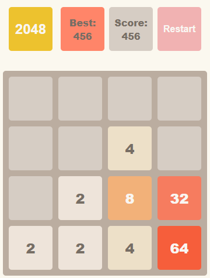

# The Game 2048

  [DEMO LINK](https://proph7000.github.io/Game_2048/)

  2048 is an easy and fun puzzle game. Even if you don't love numbers you will love this game. It is played on a 4x4 grid using the arrows. Every time you press a key - all tiles slide. Tiles with the same value that bump into one-another are merged. Although there might be an optimal strategy to play, there is always some level of chance. If you beat the game and would like to master it, try to finish with a smaller score. That would mean that you finished with less moves.

  

# Rules
  In this game, the player must combine tiles containing the same numbers until they reach the number 2048. The tiles can contain only integer values starting from 2 (10% chance of spawning 4), and that are a power of two, like 2, 4, 8, 16, 32, and so on.

  The board has dimension of 4 x 4 tiles, so that it can fit up to 16 tiles. If the board is full, and there is no possible move to make like merging tiles together - the game is over.

# Technologies used:
  - JS;
  - HTML;
  - SCSS;
